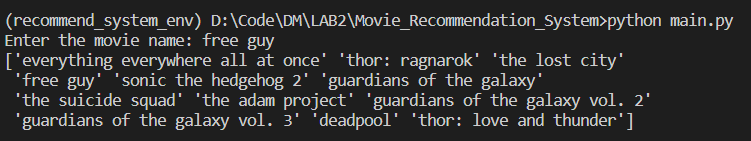

# Movie Recommendation System

## Movie Recommendation using clustering

This is a small project on Movie Recommendation System using K Means Clustering. This project was carried out by scraping the top movies of various genres in the IMDB official site. Using the genres as properties these movies were clustered.

## About scripts

- [x] scraper.py to scrape imdb website

- [x] main.py to run the code in order (No need to run pre_processing.py and clustering_code.py they are imported by main and run automatically)

- [x] pre_processing.py to preprocess the scraped data and store in desired format

- [x] clustering_code.py to prepare data and fit to kmeans clustering model from sklearn

- [x] plot.py to plot the cluster graph

### Plot can be seen here

### Output can be seen here

## Prepared as part of Data Mining Practical taught by [Siddhant Sharma](https://github.com/Siddhant128-bit)